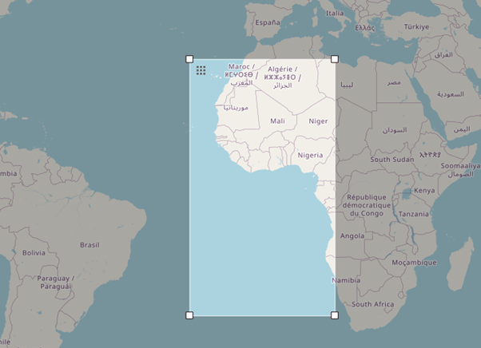
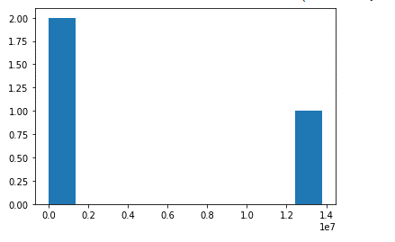
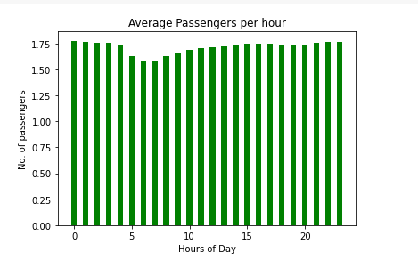
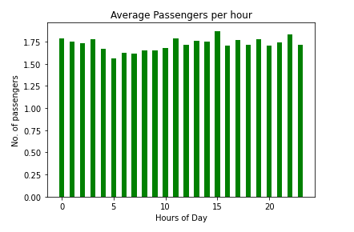

# Analysis of NYC Trip Data

In this project, we analyzed a dataset that contains information about taxi rides in NYC. The dataset is quite large so getting a basic idea of what the data contains is important.

## Data Description

- **Datetime Range:** Pickup - 2013-04-31 00:00:00 to 2013-04-31 23:59:58, Dropoff - 2013-04-01 00:00:39 2013-05-01 to 01:16:32
- **Total Rows:** There are a total of 13,823,840 rows in the dataset.

## Field Names and Descriptions

- Medallion: This is a text field which stores an identification to an object such as a medal.
- hack_license: This is similar to the medallion and also stores an identification to the license.
- vendor_id: This is an identification for the vendor.
- rate_code: This is a field which would most likely stores the link to a record which shows how the trip should be charged.
- store_and_fwd_flag: A field which can be used to check for conditions.
- pickup_datetime: This the time when the taxi rider was picked up.
- dropoff_datetime: The time when the taxi rider was dropped off at their destination.
- passenger_count: This is an integer that shows the number of passengers in the taxi.
- trip_time_in_secs: The time the entire trip took from the pickup location to the destination.
- trip_distance: The distance from the pickup location to the destination.
- pickup_longitude: This is a decimal number that shows the longitude where the rider was picked up at.
- pickup_latitude: A decimal number that shows the latitude where the rider was picked up at.
- dropoff_longitude: A decimal number showing the longitude location where the location was used at.
- dropoff_latitude: This is a decimal number that shows the latitude where the rider was dropped off at.

The longitude and latitudes are used together to show the exact location of a user on a map.

## Some sample data for each field.
| Field Name           | Data Sample                                         |
|----------------------|-----------------------------------------------------|
| Medallion             | 9406D2C34715E1DA10AD4D4DDADF4DA5                    |
| hack_license          | 0602DFD837433635FE860BDE2F14BC3A                    |
| vendor_id             | VTS                                                 |
| rate_code             | 1                                                   |
| store_and_fwd_flag    | N                                                   |
| pickup_datetime       | 2013-07-01 01:47:00                                 |
| dropoff_datetime      | 2013-07-01 01:52:00                                 |
| passenger_count       | 1                                                   |
| trip_time_in_secs     | 300                                                 |
| trip_distance         | 1.17                                                |
| pickup_longitude      | -74.013229                                          |
| pickup_latitude       | 40.714718                                           |
| dropoff_longitude     | -74.003906                                          |
| dropoff_latitude      | 40.742031   

## MySQL data types/len need to store each of the fields

Field | Data Type | Length
--- | --- | ---
Medallion | Varchar | 100
hack_license | Varchar | 100
vendor_id | Varchar | 3
rate_code | Int | 1
store_and_fwd_flag | Varchar | 1
pickup_datetime | Datetime | datetime
dropoff_datetime | Datetime | datetime
passenger_count | Int | 2
trip_time_in_secs | Int | 10
trip_distance | Decimal | 3,2
pickup_longitude | Decimal | 2,6
pickup_latitude | Decimal | 2,6
dropoff_longitude | Decimal | 2,6
dropoff_latitude | Decimal | 2,6

## Geographic range of your data (min/max - X/Y)
| Coordinate             | Min | Max |
|--------------------|-----------|-----------|
| Latitude         | 40.500053     | 40.8999963        |
| Longitude   | -74.25       | -73.700111       |

## Plot this (approximately on a map)

## Average computed trip distance
The average trip distance is 12.743926394710524 KM

## Histogram of the trip distances 

## The distinct values for each field? (If applicable)

| Field | No. of Distinct Values | Distinct Values |
| ----- | --------------------- | --------------- |
| Medallion | 13434 |  |
| Hack license | 32788 |  |
| Vendor ID | 2 | 'VTS', CMT |
| rate_code | 11 | 1,   5,   3,   2,   4,   8,   0,   6, 210,   7,   9 |
| store_and_fwd_flag | 3 | '', N, Y |
| pickup_datetime | 2293629 | |
| passenger_count | 8 | 1, 5, 4, 6, 2, 3, 0, 8 |
| trip_time_in_secs | 6145 | |
| dropoff_datetime | 2296818 | |
| trip_distance | 4252 | |
| pickup_longitude | 37885 | |
| pickup_latitude | 62924 | |
| dropoff_longitude | 55140 | |
| dropoff_latitude | 88407 | |

## Numeric types besides lat and lon, what are the min and max values

| Field              | Max Value | Min Value |
|--------------------|-----------|-----------|
| rate_code          | 210       | 0         |
| passenger_count    | 8         | 0         |
| trip_time_in_secs  | 10800     | 0         |
| trip_distance      | 100.0     | 0.0       |

## Chart which shows the average number of passengers each hour of the day. (X axis should have 24 hours)

## New CSV file which has only one out of every thousand rows.

The two chart are very similar in that they show that the number of trips increase as at around 1900 hrs when most people are heading from work. Then there is a drop at 5 am when most people are asleep followed by s stead rise in the number of trips as the day progresses.